<h1 align="center">Karina Borges</h1>
<h3 align="center">AI Architecture & Workflow Principal Engineer</h3>

Designing agentic systems, MCP tooling & spec-driven workflows — on a React · TypeScript · Next.js foundation

  
  
  
  

  
  
  

---

### About

I design the architecture and workflows behind AI-augmented software. My work centers on **agentic systems**, **Model Context Protocol (MCP)** tooling, and **spec-driven development** — turning frontier models into reliable, production-grade engineering leverage rather than one-off demos. These days I build most of my agent systems in **Python**.

That practice sits on a deep **React · TypeScript · Next.js** foundation: years of building and leading scalable web platforms, from monorepo infrastructure to real-time product features. My background in **Environmental Engineering** gave me a systems-thinking mindset I bring to every architectural decision — balancing reliability, maintainability, and developer experience across teams.

Based in **Brazil**, working with **international clients**. **AWS Certified**.

---

### What I Work On

| Focus | What it means in practice |
| --- | --- |
| **Agentic Workflows** | Designing multi-step agent systems that plan, act, and self-correct — with the guardrails to run them in production. |
| **MCP & Tooling** | Building Model Context Protocol servers and developer tools that give AI models safe, structured access to real systems. |
| **Spec-Driven Development** | Treating specs as the source of truth so AI-generated code stays correct, reviewable, and aligned with intent. |
| **Frontend Architecture** | Scalable React/Next.js platforms — monorepos, shared component systems, performance (Core Web Vitals) and accessibility as first-class concerns. |

---

### Selected Work

**Spec-driven development tooling** — Designing and building a workflow platform that turns product specs into a reliable contract for AI-assisted implementation, keeping generated code reviewable and aligned with intent.

**Autonomous trading agent** — A fully autonomous Claude-powered agent that makes its own trading decisions against a live exchange API and publishes every trade to a real-time Next.js dashboard backed by a Postgres API. → **[Live dashboard](https://claude-trades-dashboard-pry9a4l4h-karina-borges-projects.vercel.app/)**

**MCP developer tooling** — Creating Model Context Protocol servers and reusable agent libraries that extend AI models with safe, structured access to developer environments and external systems.

**Personal knowledge architecture** — A markdown-based knowledge system with automated capture and triage workflows, wiring my daily engineering practice into a durable, queryable second brain.

> Much of my recent work lives in private client and R&D repos. For the full story, see my **[portfolio](https://www.karina-borges.com)** and **[blog](https://www.karina-borges.com/en/posts)**.

---

### Writing

I write about AI-augmented development — agentic workflows, MCP, and spec-driven engineering — at **[my blog](https://www.karina-borges.com/en/posts)**. Practical notes from building these systems with real clients.

---

### Tech Stack

  
  
  
  
  
  
  
   
  
  
  
  
  
  
   
  
  
  

---

### GitHub Activity

  

---

  <strong>Let's build something.</strong> &nbsp;·&nbsp; <a href="mailto:karinaborges@outlook.com">karinaborges@outlook.com</a>

